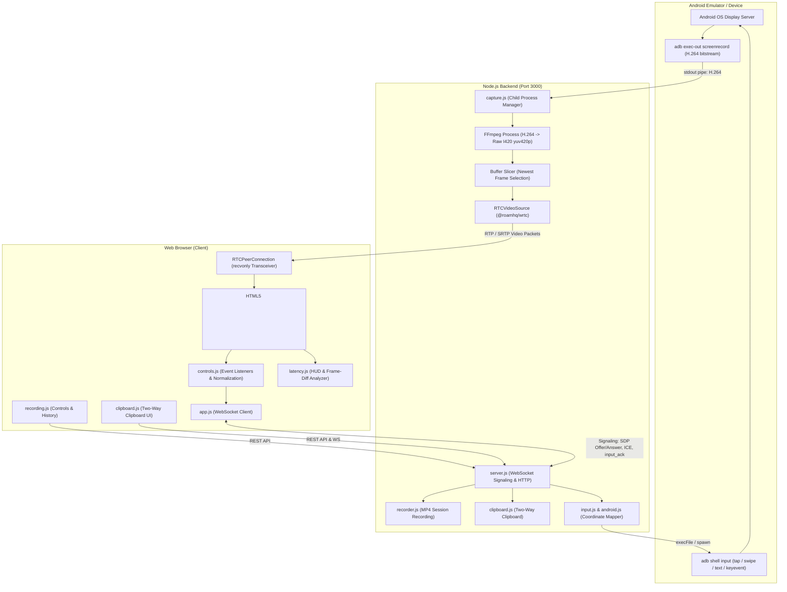

# System Architecture & Technical Design

## 1. Executive Summary

HealthTick is an interactive remote desktop platform engineered specifically for Android devices and emulators. It renders a live Android screen inside a web browser and enables bi-directional interaction (taps, drags, swipes, text, and keys) with low latency.

The system requires **no custom Android client app or rooting**. It relies entirely on standard Android Debug Bridge (`adb`) facilities, an intermediate Node.js media server, FFmpeg transcoding, and native WebRTC transport.



---

## 2. Core Architectural Pipelines

### 2.1 Android Screen Capture Pipeline
- **Mechanism**: The backend spawns `adb exec-out screenrecord --size 540x1200 --bit-rate 2000000 --output-format h264 -`.
- **Why `exec-out`**: Traditional `adb shell` attaches a pseudoterminal (pty) that injects carriage return/newline conversions (`\r\n`) and corrupts binary payloads. `adb exec-out` bypasses pty translation, streaming pure binary H.264 Annex B byte streams directly to `stdout`.
- **Resolution & Bitrate**: Resolution is constrained to $540 \times 1200$ at $2.0 \text{ Mbps}$. This drastically lowers the CPU burden on the emulator's hardware encoder and ensures smooth real-time generation.

### 2.2 FFmpeg Frame Conversion Pipeline
- **Input**: FFmpeg receives the H.264 byte stream piped from ADB into `pipe:0`.
- **Transcoding**:
  ```bash
  ffmpeg -loglevel error -f h264 -i pipe:0 -pix_fmt yuv420p -f rawvideo pipe:1
  ```
- **Frame Slicing & Backlog Prevention**:
  - Raw uncompressed I420 frame size:
    $$\text{FrameSize} = \text{Width} \times \text{Height} \times 1.5 = 540 \times 1200 \times 1.5 = 972,000 \text{ bytes}$$
  - FFmpeg stdout chunks are accumulated in a Node.js `Buffer`.
  - When complete frames are available, the pipeline takes the **latest complete frame** and immediately discards prior complete frames:
    ```javascript
    const latestOffset = (completeFrames - 1) * frameSize;
    const latestFrame = buffer.subarray(latestOffset, latestOffset + frameSize);
    buffer = buffer.subarray(completeFrames * frameSize);
    ```
  - This drop-oldest-frame strategy prevents backpressure lag from accumulating when the client browser or encoder momentarily lags.

### 2.3 WebRTC Video Transport
- **Node.js WebRTC Provider**: Utilizes `@roamhq/wrtc`, which provides headless WebRTC C++ bindings for Node.js.
- **Media Injection**: An `RTCVideoSource` instance is configured with `{ isScreencast: true }`.
- **Frame Injection**: Uncompressed I420 byte buffers are fed into `videoSource.onFrame({ width: 540, height: 1200, data })`.
- **Transmission**: The internal WebRTC stack packetizes, encrypts (SRTP), and transmits video over RTP via standard UDP/ICE candidates to the browser.

### 2.4 WebSocket Signaling & ICE Negotiation
- Signaling runs over a lightweight WebSocket channel (`/ws`) hosted on the same HTTP server:
  1. **Offer Generation**: The browser creates an `RTCPeerConnection` with a `recvonly` video transceiver and generates an SDP offer:
     ```json
     { "type": "offer", "offer": { "type": "offer", "sdp": "..." } }
     ```
  2. **Answer Generation**: The backend passes the offer to `peerConnection.setRemoteDescription()`, creates an SDP answer, sets local description, and returns:
     ```json
     { "type": "answer", "answer": { "type": "answer", "sdp": "..." } }
     ```
  3. **Candidate Exchange**: Both client and server listen for `icecandidate` events and transmit them as:
     ```json
     { "type": "candidate", "candidate": { ... } }
     ```
  4. Candidate buffering ensures candidates arriving before `setRemoteDescription` are queued and added once the remote description is active.

### 2.5 Browser-to-Android Input Flow
Input actions are captured as standard browser DOM events and serialized as JSON messages over the WebSocket:
- **Tap**: `{ type: "tap", x: 270, y: 600, requestId: "...", clientTimestamp: 1712... }`
- **Swipe**: `{ type: "swipe", startX, startY, endX, endY, duration, requestId, ... }`
- **Text**: `{ type: "text", text: "hello", requestId, ... }`
- **Key**: `{ type: "key", key: "Enter" | "Backspace", requestId, ... }`

The backend decodes the message, transforms coordinates, and dispatches native ADB commands via `child_process.spawn("adb", ["shell", "input", ...])`.

---

## 3. Coordinate Scaling & Viewport Normalization

A critical problem in remote device streaming is maintaining pixel-perfect coordinate mapping across varying screen resolutions, browser window resizes, and CSS zoom levels.

```
+-----------------------------------------------------------+
| Browser Viewport: clientX, clientY                       |
|   |                                                       |
|   v [Relative to video bounding box: rect.left, rect.top] |
| Local Video Element CSS Pixels                            |
|   |                                                       |
|   v [Scale by: video.videoWidth / rect.width]             |
| Video Stream Canvas Coordinates (540 x 1200)             |
|   |                                                       |
|   v [Scale by: android.physicalWidth / 540]               |
| Android Native OS Hardware Coordinates (e.g. 1080 x 2400) |
+-----------------------------------------------------------+
```

### Exact Mathematical Transformation

1. **Browser Client to Video Pixel Space**:
   $$x_{\text{video}} = (e.\text{clientX} - \text{rect.left}) \times \frac{\text{video}.\text{videoWidth}}{\text{rect.width}}$$
   $$y_{\text{video}} = (e.\text{clientY} - \text{rect.top}) \times \frac{\text{video}.\text{videoHeight}}{\text{rect.height}}$$
2. **Video Pixel Space to Android Physical Screen Space**:
   $$x_{\text{android}} = \left\lfloor x_{\text{video}} \times \frac{\text{AndroidWidth}_{\text{physical}}}{540} + 0.5 \right\rfloor$$
   $$y_{\text{android}} = \left\lfloor y_{\text{video}} \times \frac{\text{AndroidHeight}_{\text{physical}}}{1200} + 0.5 \right\rfloor$$

### Optimization: Screen Geometry Caching
Instead of running `adb shell wm size` on every user tap (which introduced ~80–120 ms of unnecessary latency per action), the backend queries screen geometry once at startup and caches the result. If ADB fails or disconnects, a safe fallback ($540 \times 1200$) is used to prevent process crashes.

---

## 4. Session Lifecycle & Process Cleanup

A major architectural failure in naive WebRTC-ADB implementations is **process leak**—when orphaned `adb` and `ffmpeg` processes remain running indefinitely after a browser tab is closed.

### Lifecycle Architecture

1. **Connection**: Browser connects to `/ws`. A WebRTC peer connection and WebSocket session are created.
2. **Stream Initiation**: When the SDP `offer` is accepted, the capture pipeline starts:
   `captureProcesses = startAndroidCapture(webrtc.getVideoSource())`.
3. **Connection Termination**:
   - The browser closes the tab, navigates away, or disconnects.
   - `socket.on("close")` is triggered.
   - The server stops WebRTC video tracks and closes the peer connection.
   - The server explicitly kills child processes:
     ```javascript
     if (captureProcesses.adb && !captureProcesses.adb.killed) captureProcesses.adb.kill();
     if (captureProcesses.ffmpeg && !captureProcesses.ffmpeg.killed) captureProcesses.ffmpeg.kill();
     ```
   - This ensures memory and CPU consumption on the host machine return to baseline.

---

## 5. Latency & Performance Trade-offs

| Architectural Decision | Trade-off Made | Rationale |
| :--- | :--- | :--- |
| **$540 \times 1200$ @ 2 Mbps vs $1080 \times 2400$ @ 8 Mbps** | Lower visual resolution for substantially lower encode delay and CPU usage. | $1080\text{p}$ capture on emulator consumes high CPU and introduces 150+ ms extra frame buffer latency. $540\text{p}$ maintains clear text legibility while sustaining 30 FPS. |
| **Drop-oldest frame buffer policy** | Sacrifices historical frame fidelity to eliminate latency accumulation. | If network or render throughput dips, queuing frames causes the display to lag seconds behind live interaction. Discarding older frames keeps the stream anchored to real time. |
| **ADB `input` CLI vs Native Accessibility Service** | CLI invocation adds ~20–40 ms spawn overhead per action; eliminates requirement for pre-installed APKs or root access. | Deploying an on-device Android daemon/Accessibility Service complicates setup and violates zero-install design requirements. |
| **Headless WebRTC (`@roamhq/wrtc`) vs WebSocket binary image streaming** | High WebRTC build complexity; yields standardized jitter buffers, congestion control, and hardware decode in the browser. | WebRTC handles packet loss recovery, variable bitrates, and hardware decoding far more gracefully than custom WebSocket chunk streaming. |

---

## 6. Alternatives Considered & Rejected

### 1. Scrcpy Native Server
- *Considered*: Running the `scrcpy-server.jar` on the Android device over ADB app_process.
- *Rejected*: Requires deploying a custom Java JAR binary onto `/data/local/tmp` on the Android device, maintaining compatibility across Android API 21 through 35, and implementing custom video/control protocol framing in Node.js.
- *Why ADB screenrecord was chosen*: `adb screenrecord` is built into every modern Android ROM and requires zero files to be written to the device filesystem.

### 2. MJPEG / WebSocket Canvas Streaming
- *Considered*: Capturing screen screenshots via `adb exec-out screencap -p` and transmitting JPEG frames over WebSocket.
- *Rejected*: `screencap -p` takes ~120–250 ms per frame on Android emulators, maxing out at 4–7 FPS while producing huge network bandwidth ($> 20 \text{ MB/s}$).
- *Why WebRTC was chosen*: Real-time H.264 video compression provides 30 FPS at only 2 Mbps bandwidth with sub-40ms playout delay.

### 3. VNC / RDP Emulation
- *Considered*: Running a VNC server on the Android guest OS.
- *Rejected*: Android does not natively support VNC without root permissions or third-party service apps running in the background.

---

## 7. Security Considerations

1. **Signaling Boundary**: The WebSocket signaling server currently binds to `localhost:3000`. In a production deployment, the signaling layer must sit behind TLS (`wss://`) with JWT token authentication.
2. **Command Injection Hardening**: All ADB commands use `child_process.spawn()` or `execFile()` with strict argument arrays—never shell string interpolation (`exec("adb shell " + input)`). Taps and swipes strictly parse numeric coordinates (`Number()`), and keyboard text substitutes spaces with `%s` to prevent command injection into the Android shell.
3. **Device Isolation**: Multi-tenant deployments must isolate ADB daemon connections per container to prevent cross-tenant device access.

---

## 8. Current Limitations & Future Roadmap

- **Audio Streaming**: Android `screenrecord` does not capture device audio. Capturing audio requires Android 10+ AudioPlaybackCapture API or custom audio daemon routing.
- **Physical Multi-Touch Gestures**: Currently supports single-finger tap, swipe, and scroll. Pinch-to-zoom requires multi-pointer event tracking and ADB `sendevent` scripting.
- **Direct H.264 WebRTC Track Forwarding**: Transcoding H.264 to raw I420 via FFmpeg in the backend introduces ~25–35 ms of CPU transcoding delay. Future work will investigate directly packetizing H.264 NAL units into WebRTC RTP packets without decoding to YUV.
